# ATS Dashboard

A responsive ATS (Applicant Tracking System) Dashboard built using React.js and Bootstrap.  
This project helps manage jobs, candidates, and recruitment workflow with a clean and modern UI.

---

## Features

- User login
- Dashboard Management
- Candidate Management
- Job Listings
- Search & Filter Functionality
- Dark Mode Support
- Responsive Design

---

## Tech Stack

- React.js
- JavaScript
- Bootstrap
- React Router DOM
- CSS

---

## Project Structure

```bash
/ats-dashboard/
│
├── public/
│
├── src/
│   ├── components/
│   │   ├── BackButton.jsx
│   │   ├── CandidateModal.jsx
│   │   └── JobModal.jsx
│   │
│   ├── data/
│   │   ├── candidatesData.js
│   │   ├── dashboardData.js
│   │   ├── jobsData.js
│   │   └── users.js
│   │
│   ├── pages/
│   │   ├── Candidates.jsx
│   │   ├── Dashboard.jsx
│   │   ├── Jobs.jsx
│   │   └── Login.jsx
│   │
│   ├── App.js
│   ├── index.js
│   └── index.css
│
├── package.json
└── README.md
```

---

## Installation & Setup

### i Clone the Repository

```bash
git clone https://github.com/prathameshnevase158-debug/ats-dashboard.git
cd ats-dashboard
```

---

### ii Install Dependencies

```bash
npm install
```

---

### iii Run the Project

```bash
npm start
```

---

## Screenshots
# Screenshots

## Login Page
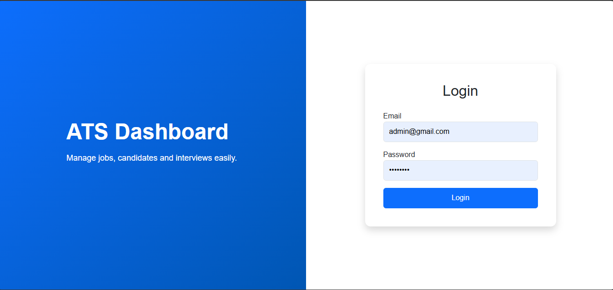

## Dashboard
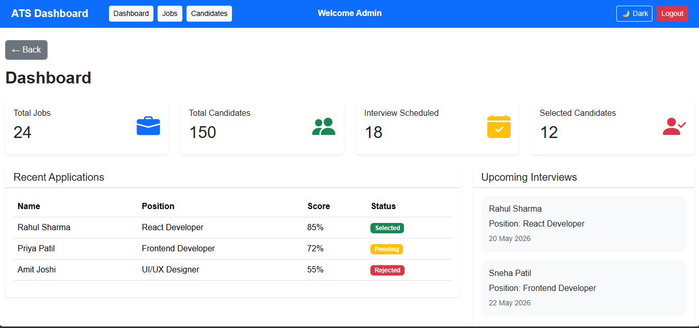

## Dashboard Dark Mode
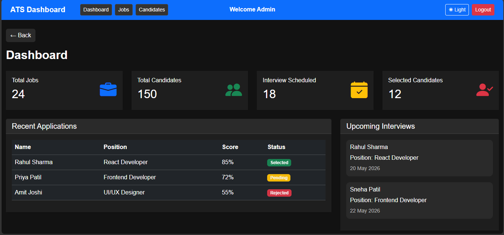

## Jobs
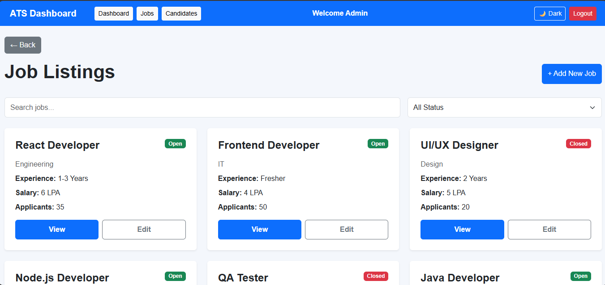

## Jobs Dark Mode
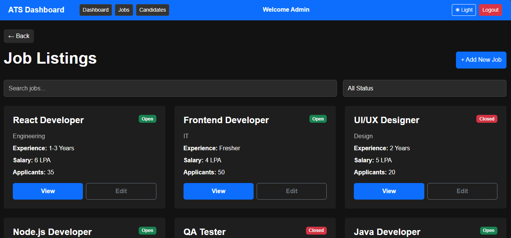

## Candidates
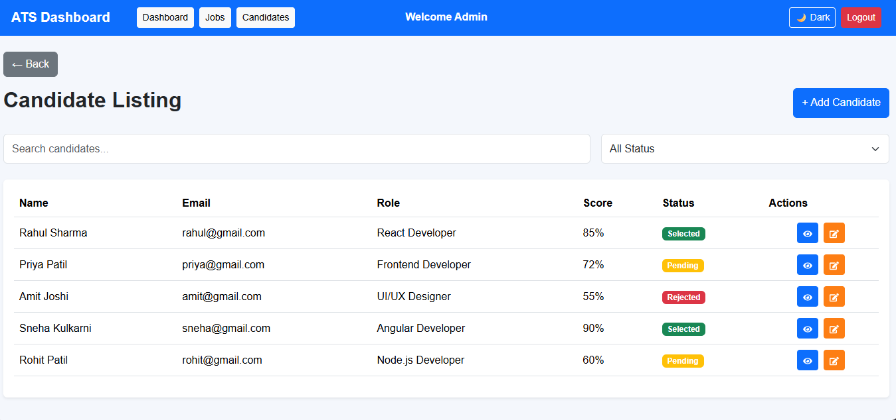

## Candidate Dark Mode
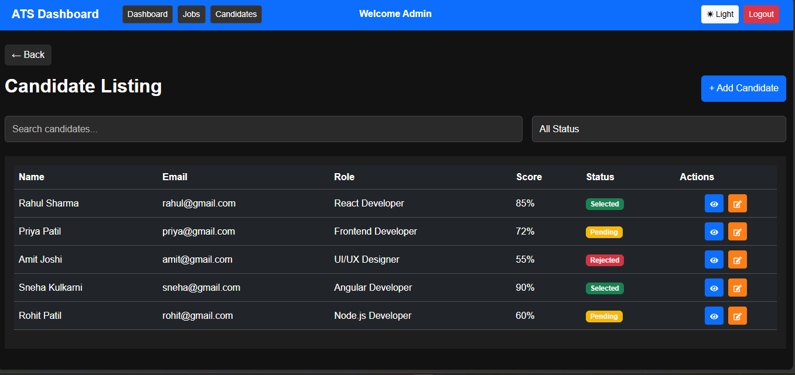

## Add Job
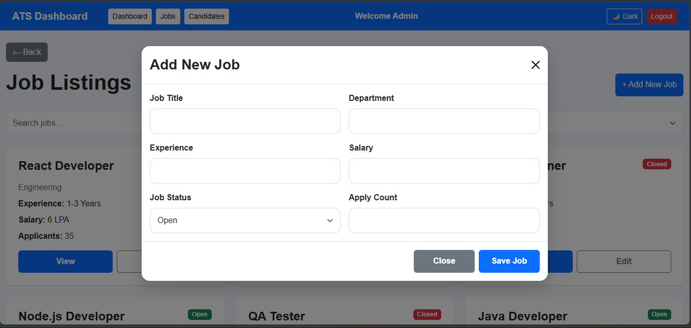

## Add Job Dark Mode
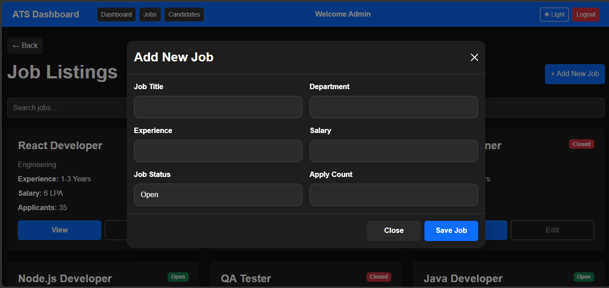

## Add Candidate
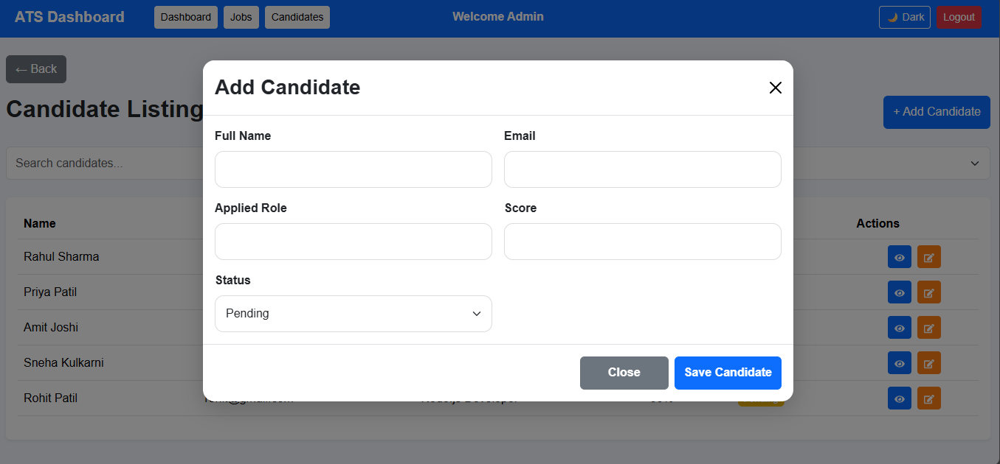

## Add Candidate Dark Mode
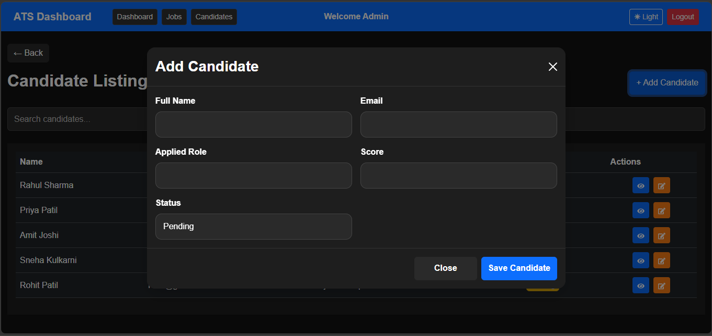

---

## Live Demo

https://ats-dashboard-uz8v.vercel.app/

---

## GitHub Repository

https://github.com/prathameshnevase158-debug/ats-dashboard

---

## Author

Prathamesh Nevase

---
